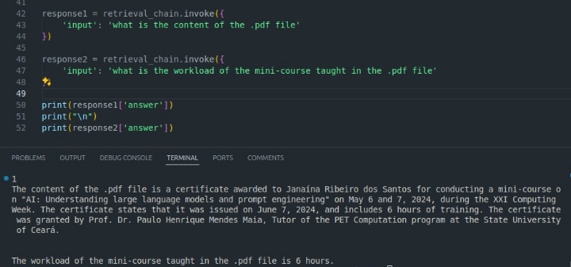

# Geração Aumentada de Recuperação com Google Gmail API 


Por *Janaína Ribeiro*

## Descrição do projeto

O seguinte projeto desenvolvido busca ajudar o usuários nas tarefas de consulta aos seus emails, facilitando trabalhos que envolvem à análise de emails da caixa de entrada. Por meio da geração aumentada de recuperação, a ferramenta recupera o contexto com base em um banco de dados vetorial que irá armazenar informações dos emails do usuário, otimizando os resultados dos grandes modelos nas saídas geradas diante a uma consulta feita. 

O Google Gmail API permite que seja realizada a autenticação do usuário com o aplicativo e gerencia as permições para acesso ao email. Utilizando a API podemos ler, redigir e obter os emails com segurança.

## Acessando o gmail via App 

Para sincronizar a aplicação com dados de email do usuário é necessário que seja cadastrado um novo projeto no Google WorkSpace clicando aqui [Novo Projeto](https://console.cloud.google.com/projectcreate). Crie em "[Credenciais](https://console.cloud.google.com/apis/credentials)" as credencias do tipo "ID do Cliente OAuth2" para autenticação via OAuth2. Por fim, busque nas bibliotecas e ative o serviço "Gmail API" em "[API e serviços ativados](https://console.cloud.google.com/apis/library)" no projeto.

## Instalação 

Via comando git clone você pode baixar esse repositório para ter acesso aos códigos, digite a seguinte linha de comando abaixo: 

> git clone https://github.com/janaina-sudo/RAGWITHEMAILSGMAIL.git

Em seguida, crie uma celula e execute os seguintes comandos, ou utilize um ambiente virtual, para instalar as dependencias necessárias:

```
pip install -U langchain-community

pip install google-oauth2-tool

pip install --upgrade --quiet  google-api-python-client

pip install --upgrade --quiet  google-auth-oauthlib

pip install --upgrade --quiet  google-auth-httplib2

pip install --upgrade --quiet  beautifulsoup4

```

## Executando o projeto

O projeto encontra-se com dois notebooks criados sendo eles: download_emails.ipynb e RAG_Emails.ipynb. Execute na sequência:

     download_emails.ipynb

em seguida: 

     RAG_Emails.ipynb

### Explicando cada notebook

O notebook "download_emails.ipynb" contém uma classe que realiza a autenticação do usuário e gerencia as requisições de busca, leitura e download do emails. Ela contém o construtor que recebe a variável "SCOPES" e "Our_Gmail" responsaveis por redirecionar o usuário para o gmail para permitir que a aplicação tenha acesso aos dados do gmail. As suas funções busca, ler, analisa partes do email (realizando o download do texto do email separado do anexo), cria o diretório para armazenar pastas referentes a cada email e converte o email em bytes no formato legivel a nível de máquina. Existe um limite de emails baixando da caixa de entrada, sendo definido 300 como *default*, podendo ser modificiado conforme as necessidades do usuário. 


O notebook "RAG_Emails.ipynb" processa os emails do diretório criado em "download_emails". O código é composto por funções para limpeza de tela, rag com llm e a função principal. 

A função clean_screen detecta o sistema operacional para realizar a limpeza do terminal após inserção de dados (no caso quando a extensão do script é .py). 

A função rag_llm recebe como parametros a consulta e o tipo de carregamento, se é .eml ou .pdf de acordo com a escolha do usuário, e realiza o processamento de todos os arquivos selecionado. Cria os ebeddings, divide o documento e armazena em um banco de dados vetorial chamado FAISS. O retorno da função é a resposta a consulta do usuário. Por fim, a função principal busca interagir com o usuário para saber se a consulta é referente a textos ou arquivos anexados em pdf dos emails realizando a chamada das funções anteriormente citadas.


## Exemplos de consulta

Atráves de um prompt bem elaborado consegue-se extrair informações relevantes do modelo, abaixo segue alguns exemplos básicos de prompt para utilizar como consulta. 

- Quem enviou o email "titulo"? (exemplo carregado no notebook)

- Qual o conteúdo do corpo do anexo "titulo.pdf"?

- Quem enviou o último email recebido?

- Qual o último email enviado por "nome remetete"?

Segue um exemplo de consulta e em arquvios pdfs realizado durante os testes do Script e exploração das respostas do modelo:



## Ferramentas utilizadas

1) Google Gmail API
2) LangChain
3) Jupyter Notebook


## Limitações 

Durante o desenvolvimento do projeto as dificuldades foram voltadas para o processamento dos emails utilizando as classes de carregamento do langChain, contudo, foi criado um método para baixar os emails e seus anexos de forma separadas podendo assim realizar o processamento individual de arquivos em anexos no formato .pdf e arquivos textuais de email .eml. Logo, o usuário terá a escolha de realizar consultas sobre o texto ou anexo dos seus emails.